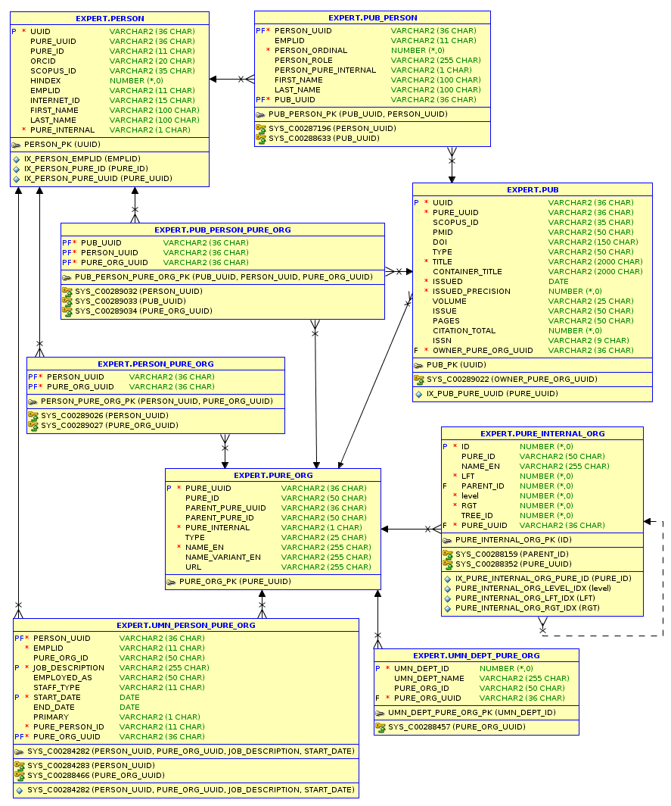

# Experts@Minnesota Database Schema

Schema for the [Experts@Minnesota project](https://www.lib.umn.edu/about/experts) database.

## Overview

UMN Libraries created this database to complement the Elsevier product, Pure, which we have branded
[Experts@Minnesota](https://experts.umn.edu). We did this both to provide alternative means of access
to some of the data, as well as to maintain a vendor-independent, UMN-local copy of that data.

## Access

Read-only direct SQL access is available to anyone with a UMN internet ID. This database is on the OIT Oracle Hotel,
currently only on the tst instance, with access granted via the `oit_expert_rd_all` role, managed by OIT. Each role
member must be an Oracle Hotel account, or "schema" in Oracle-speak. These accounts can be personal internet IDs or
departmental/functional accounts. Note that personal internet IDs must use Duo two-factor authentication, so a 
functional/departmental account will be better for non-interactive, automated access. For access to the role and
database connection information, and to optionally create an Oracle Hotel account, send email to: dbrequests@umn.edu
The DBAs at that address will probably tell you to go to the
[Access Request Forms on Service Now](https://umnprd.service-now.com/nav_to.do?uri=%2Fhome.do) and fill out the
"IT Hosted Databases" form with the information described above. If you already have an Oracle Hotel account you
want to use, it may be faster to just go to that form directly.

Also, Elsevier has just added to Pure a new JSON-based web services API, which we are currently evaluating. We had
originally planned to design and implement our own web services API. However, it seems the Pure JSON-based API may
meet user needs, so we are deferring that plan for now.

## Announcements & Discussion

Announcements and discussion about this database and other Experts@Minnesota services happen on both the
__Experts Data Warehouse-API__ Google Group and on the __#research-activity__ channel on
[Tech-People UMN Slack](https://tech-people-umn.slack.com). Both are open to anyone with a UMN internet ID.

## Maturity

It may be charitable to assign this database an alpha level of maturity. Probably obvious that this repository
is a bit of a mess. We want your feedback to help make it better! Our goal was to release a useful, usable
product to users as soon as possible. We recognize that we can't give you exactly what you need or want without
working directly with you to find out what that is. Please join the user community discussion by following
the instructions above.

## Data Model Design

Of course the Pure data model heavily influenced the design of this data model, but 
[Citation Style Language (CSL)](http://docs.citationstyles.org/en/stable/index.html) was at least as big an influence.
Again, one goal was vendor-independence. CSL is a popular standard used by many citation managers. Another goal
was to find a robust data model already implemented in popular web services APIs.
[csl-data.json](https://github.com/citation-style-language/schema/blob/master/csl-data.json) was the best such model
we could find. Our upcoming web services will adhere to it as closely as possible.

### Organizational Complexity

As the diagrams and documentation below should make painfully obvious, the data model is most complex
wherever organizations are involved. We especially welcome feedback from users about these parts of the
data model. There are likely many improvements we could make to allow for more convenient and performant 
queries, as well as conceptual clarity and simplicity.
 
## Entity Relationship Diagram (ERD)

The following diagrams are exports from [Oracle SQL Developer](http://www.oracle.com/technetwork/developer-tools/sql-developer/overview/index-097090.html).

[Scalable version (PDF)](https://github.com/UMNLibraries/experts-dw-schema/blob/master/erd.pdf)

## Data Dictionary

The following information, in a separate section for each table, is in the database itself, in the form of
comments on all tables and columns. We re-produce it here for convenience.

### PERSON

A person, usually an author of research outputs. May be internal or external to UMN.

| Column | Description |
| ------ | ----------- |
| UUID | Universally-unique ID for the person, generated for this Experts@Minnesota database. |
| PURE_UUID | Universally-unique ID for the person in our [Elsevier Pure database](https://experts.umn.edu). |
| PURE_ID | Unique ID for the person in our [Elsevier Pure database](https://experts.umn.edu). For UMN persons whose data we loaded into the Elsevier predecessor product, SciVal, this will be the SciVal ID. For other UMN persons whose data we have loaded into Pure, this will be the UMN employee ID (emplid). For UMN-external persons, this will be NULL. Note that because we have not loaded data for all UMN persons into Pure, some UMN persons will be classified as external in Pure. |
| ORCID | [Open Researcher and Contributor ID](https://orcid.org/) for the person. |
| SCOPUS_ID | Unique ID for the person in the [Elsevier Scopus database](https://www.elsevier.com/solutions/scopus). |
| HINDEX | An index that attempts to measure both the productivity and impact of the published work of a scientist or scholar. Used only in some disciplines, so for many persons this will be NULL. [More info](https://blog.scopus.com/posts/the-scopus-h-index-what-s-it-all-about-part-i) on [blog.scopus.com](https://blog.scopus.com/posts/5-facts-about-scopus-and-the-h-index). |
| EMPLID | UMN employee ID (emplid). |
| INTERNET_ID | UMN internet ID. |
| FIRST_NAME | The given name for the person. |
| LAST_NAME | The family name for the person. |
| PURE_INTERNAL | "Y" if Pure classifies the person as UMN-internal, "N" otherwise. Note that, because we have not loaded data for all UMN persons into Pure, some UMN persons will be classified as external in Pure. |

### PUB

Research output. Named "pub", short for "publication", due to Oracle character-lenght limits.

| Column | Description |
| ------ | ----------- |
| UUID | Universally-unique ID for the item, generated for this Experts@Minnesota database. |
| PURE_UUID | Universally-unique ID for the item in our [Elsevier Pure database](https://experts.umn.edu). |
| SCOPUS_ID | Unique ID for the item in the [Elsevier Scopus database](https://www.elsevier.com/solutions/scopus). |
| PMID | Unique ID for the item in the [NCBI PubMed database](https://www.ncbi.nlm.nih.gov/pubmed/). |
| DOI | [Digital Object Identifier](https://www.doi.org/) for the item. |
| TYPE | Publication type or format of the item. See the [CSL spec](http://docs.citationstyles.org/en/stable/specification.html#appendix-iii-types) for a list of values. |
| TITLE | Primary title of the item. |
| CONTAINER_TITLE | Title of the container holding the item (e.g. the book title for a book chapter, the journal title for a journal article). |
| ISSUED | Date the item was issued/published. |
| ISSUED_PRECISION | Precision of the ISSUED column, in days: 366 (year), 31 (month), 1 (day). |
| VOLUME | Volume holding the item (e.g. “2” when citing a chapter from book volume 2). |
| ISSUE | Issue holding the item (e.g. “5” when citing a journal article from journal volume 2, issue 5). |
| PAGES | Range of pages the item (e.g. a journal article) covers in a container (e.g. a journal issue). |
| CITATION_TOTAL | Number of citations of the item. |
| ISSN | [International Standard Serial Number](http://www.issn.org/understanding-the-issn/what-is-an-issn/). |
| OWNER_PURE_ORG_UUID | Unique ID for the organization that owns the item in our [Elsevier Pure database](https://experts.umn.edu). |

### PUB_PERSON

Associates research outputs with persons (authors).

| Column | Description |
| ------ | ----------- |
| PUB_UUID | Foreign key to PUB. |
| PERSON_UUID | Foreign key to PERSON. |
| PERSON_ORDINAL | The position of the person in the author list for the research output in Pure. |
| PERSON_ROLE | "author" or "editor". Need to find Pure documentation on any other possible values. |
| PERSON_PURE_INTERNAL | "Y" if Pure classified the person as UMN-internal at the time of publication of the research output, "N" otherwise. Note that, because we have not loaded data for all UMN persons into Pure, some UMN persons will be classified as external in Pure. |
| FIRST_NAME | The given name for the person as it appears in the author list for the research output in Pure. Note that this may be differ from PERSON.FIRST_NAME. |
| LAST_NAME | The family name for the person as it appears in the author list for the research output in Pure. Note that this may be differ from PERSON.LAST_NAME. |
| EMPLID | De-normalization column. See the description in PERSON. |

### PURE_ORG

An organization (e.g. university, college, department, etc.) in Pure. May be internal or external to UMN. Pure requires all UMN-internal organizations to be part of a single hierarchy, with UMN itself as the root. Note that sometimes we combine multiple UMN departments into one Pure organization. UMN-external organizations are never part of a hierarchy in Pure, and Pure gives us limited information for them in general.

| Column | Description |
| ------ | ----------- |
| PURE_UUID | Universally-unique ID for the organization in our [Elsevier Pure database](https://experts.umn.edu). |
| PURE_ID | Unique ID for the organization in our [Elsevier Pure database](https://experts.umn.edu). NULL for UMN-external organizations, and some UMN-internal organizations. |
| PARENT_PURE_UUID | Universally-unique ID for the parent organization in our [Elsevier Pure database](https://experts.umn.edu). NULL for UMN-external organizations. |
| PARENT_PURE_ID | Unique ID for the parent organization in our [Elsevier Pure database](https://experts.umn.edu). NULL for UMN-external organizations, and some UMN-internal organizations. |
| PURE_INTERNAL | "Y" if Pure classifies the organization as UMN-internal, "N" otherwise. |
| TYPE | "academic", "college", "corporate", "department", "government", "initiative", "institute", "medical", "private non-profit", "university", or "unknown" |
| NAME_EN | Name of the organization. Called "name_en" to be consistent with Pure naming, and to indicate that this is an English name. |
| NAME_VARIANT_EN | An alternative name of the organization. Called "name_variant_en" to be consistent with Pure naming, and to indicate that this is an English name. |
| URL | The website for the organization. |

### PURE_INTERNAL_ORG

The hierarchy (tree) of Pure UMN-internal organizations. This tree uses [nested sets](https://en.wikipedia.org/wiki/Nested_set_model), as implemented by the Python package [sqlalchemy_mptt](https://pypi.python.org/pypi/sqlalchemy_mptt/). However, because Oracle supports [recursive queries](https://explainextended.com/2009/09/28/adjacency-list-vs-nested-sets-oracle/), this may not be the best implementation. Because parent-child relationships (adjacency lists) already exist in the PURE_ORG table, this entire table may be unnecessary and may go away.

| Column | Description |
| ------ | ----------- |
| ID | The unique ID for the node. Defined by sqlalchemy_mptt. |
| LFT | The left number for the node. Defined by sqlalchemy_mptt. |
| PARENT_ID | The unique ID for the parent of the node. Defined by sqlalchemy_mptt. |
| level | The depth (i.e. generation) of this node in the tree. Defined by sqlalchemy_mptt. |
| RGT | The right number for the node. Defined by sqlalchemy_mptt. |
| TREE_ID | The unique ID of the tree that contains the node. Defined by sqlalchemy_mptt, which supports multiple trees in a single table. |
| PURE_UUID | See the description in PURE_ORG. |
| PURE_ID | See the description in PURE_ORG. |
| NAME_EN | See the description in PURE_ORG. |

### UMN_DEPT_PURE_ORG

Associates UMN departments with Pure organizations. Note that many UMN departments may map to one Pure organization.

| Column | Description |
| ------ | ----------- |
| UMN_DEPT_ID | Unique ID for the UMN department in PeopleSoft. |
| UMN_DEPT_NAME | Name of the UMN department in PeopleSoft. De-normalization column. |
| PURE_ORG_UUID | Foreign key to PURE_ORG. |
| PURE_ORG_ID | De-normalization column. See the description in PURE_ORG. |

### UMN_PERSON_PURE_ORG

Associates persons that Pure classifies as UMN-internal with Pure organizations. We use this table, in addition to PERSON_PURE_ORG, because Pure attaches far more data to UMN-internal persons, some of which we use to ensure row uniqueness. Note that there are four columns in the primary key: PURE_ORG_UUID, PERSON_UUID, JOB_DESCRIPTION, and START_DATE. This is because UMN-internal persons may change positions, and also organization affiliations, over time. There may be multiple rows for the same person in this table.

| Column | Description |
| ------ | ----------- |
| PERSON_UUID | Foreign key to PERSON. |
| PURE_ORG_UUID | Foreign key to PURE_ORG. |
| JOB_DESCRIPTION | The description of this job in PeopleSoft. Maybe be better to use a job code here instead. |
| EMPLOYED_AS | Always "Academic" for the data we have loaded so far. Uncertain whether we will have other values in the future. |
| STAFF_TYPE | "academic" or "nonacademic". |
| START_DATE | The date the person started this job with this organization. |
| END_DATE | The date the person ended this job with this organization. |
| PRIMARY | "Y" if this is the person"s primary organization affiliation, otherwise "N". |
| EMPLID | De-normalization column. See the description in PERSON. |
| PURE_PERSON_ID | De-normalization column. See the description for PERSON.PURE_ID. |
| PURE_ORG_ID | De-normalization column. See the description for PURE_ORG.PURE_ID. |

### PERSON_PURE_ORG

Associates persons with their organizations.

| Column | Description |
| ------ | ----------- |
| PERSON_UUID | Foreign key to PERSON. |
| PURE_ORG_UUID | Foreign key to PURE_ORG. |

### PUB_PERSON_PURE_ORG

Associates with persons with their organization affiliations at the time of publication of a research output.

| Column | Description |
| ------ | ----------- |
| PUB_UUID | Foreign key to PUB. |
| PERSON_UUID | Foreign key to PERSON. |
| PURE_ORG_UUID | Foreign key to PURE_ORG. |

